

# Integración de políticas de mitigación de riesgo en la actualización de instrumentos de planeación municipal
## Histórico de Emergencias: Análisis de Tendencias y Concentración Espacial
### Área Metropolitana de Guadalajara · 2019–2023

**Ana Díaz-Aldret** | [orcid.org/0000-0001-5759-7563](http://orcid.org/0000-0001-5759-7563)  
**Mayra Gamboa-González** | [orcid.org/0000-0003-1260-0241](https://orcid.org/0000-0003-1260-0241)  
**Alejandro Padilla-Lepe** | [orcid.org/0000-0002-8164-7601](https://orcid.org/0000-0002-8164-7601)

  
  

---

# Introducción

- El **Área Metropolitana de Guadalajara (AMG)** concentra más de **5.2 millones** de habitantes distribuidos en 10 municipios.
- La gestión de emergencias es competencia de las **unidades de Protección Civil** y bomberos municipales.
- Contar con un **análisis histórico estandarizado** permite identificar patrones, planificar recursos y tomar decisiones basadas en evidencia.

**Fuente de datos**
Registros históricos del Sistema de Emergencias del AMG (2019–2023), con más de **158,000 reportes** georeferenciados.

---

# Objetivos

## Objetivos de análisis
1. Identificar la **tendencia anual** de emergencias en el AMG.
2. Comparar la **carga por municipio** a lo largo del tiempo.
3. Detectar los **tipos de incidentes más frecuentes**.
4. Visualizar la **concentración espacial** por año.

| Dimensión | Variable |
|---|---|
| Temporal | Año (2019–2023) |
| Territorial | Municipio |
| Tipológica | Incidente |
| Geoespacial | Coordenadas X Y |

---

# Metodología

### Procesamiento
- Se descargaron los reportes de emergencias del sitio web de Zoom Metropolitano.
- Se generó el archivo CSV.
- Estandarización de fechas y extracción de año.
- Estandarización de incidentes con 20+ categorías agrupadas por palabras clave.
- Ejecución de clustering espacial (**DBSCAN**) para identificación de núcleos críticos.
- Análisis de **niveles de priorización** estatal y municipal para sitios recurrentes.

**Principales categorías estandarizadas**
Incendio Pastizal Gas LP / Fuga
Enjambre Abejas Accidente Vial
Atención Prehospitalaria Rescate
Inundación Corto Circuito
Pirotecnia Fauna/Animales

---

# Tendencias

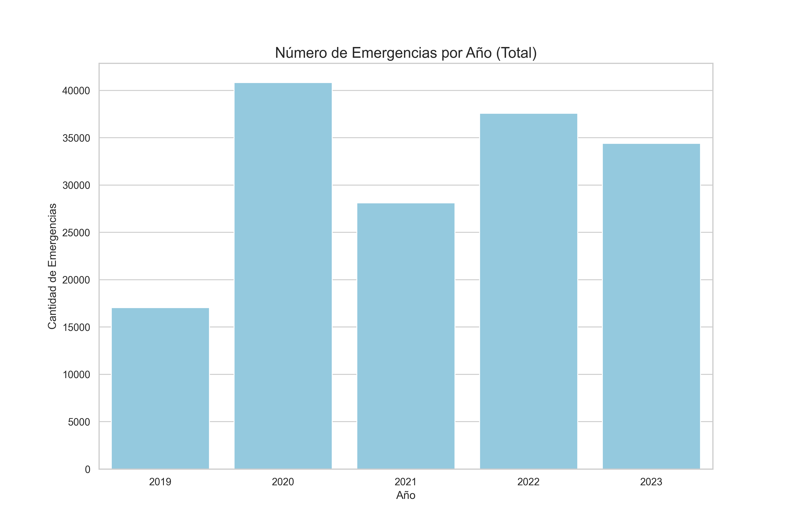

- El volumen de emergencias aumentó notablemente entre 2019 y 2022.
- 2019 cuenta con datos parciales (a partir de septiembre).
- El periodo 2020–2023 muestra la demanda operativa completa.

---

# Tendencia por Municipio

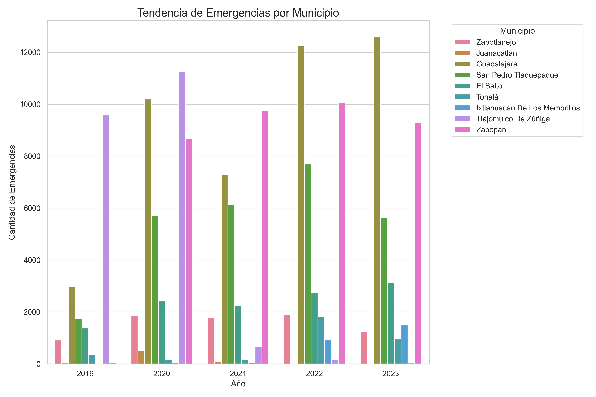

- **Guadalajara** y **Zapopan** concentran la mayor carga operativa histórica.
- Municipios como **Tlajomulco** y **El Salto** muestran crecimiento sostenido.
- El crecimiento refleja la expansión urbana en la periferia del AMG.

---

# Tendencia por Tipo de Incidente

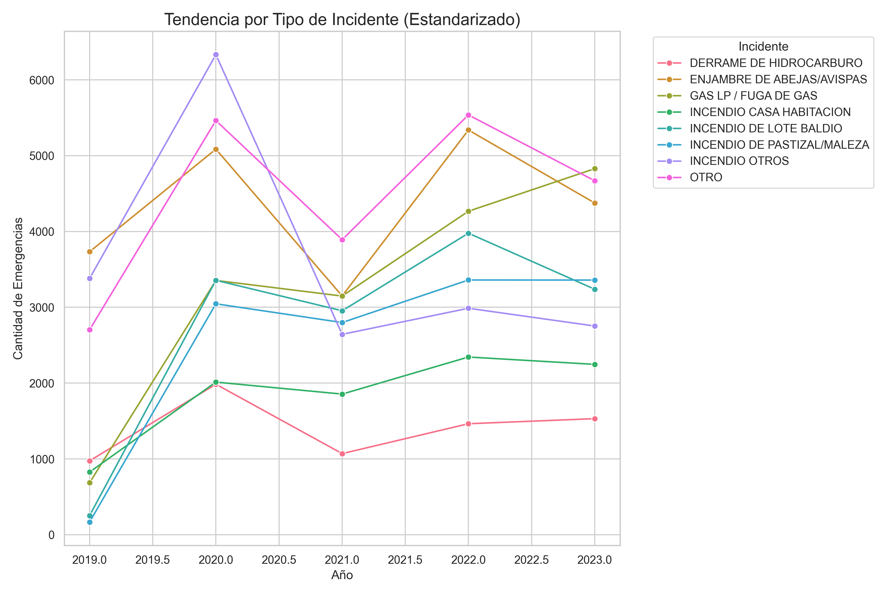

- **Derrame de hidrocarguros**: Derrame de hidrocarburos.
- **Incendios de pastizal**: Alta estacionalidad (marzo–mayo).
- **Enjambres**: Segundo incidente en frecuencia absoluta.
- **Fugas de Gas LP**: Emergencia crítica con presencia constante durante todo el año.

---

# Concentración Espacial: Mapas de Calor

Los mapas interactivos identifican zonas de alta densidad de reportes por año.

  <a href="analisis_emergencias/mapa_calor_2019.html">Mapa 2019</a>
  <a href="analisis_emergencias/mapa_calor_2020.html">Mapa 2020</a>
  <a href="analisis_emergencias/mapa_calor_2021.html">Mapa 2021</a>
  <a href="analisis_emergencias/mapa_calor_2022.html">Mapa 2022</a>
  <a href="analisis_emergencias/mapa_calor_2023.html">Mapa 2023</a>

*Nota: Abrir los archivos HTML para navegación y análisis de clusters.*

---

# Análisis de Clustering Espacial (DBSCAN)

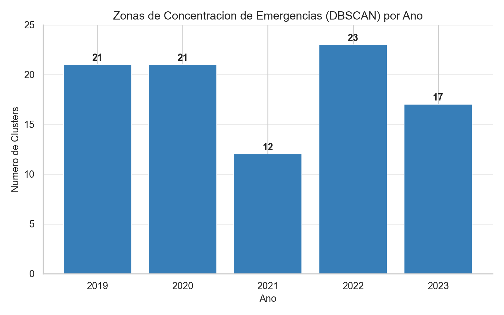

### Metodología
- Se utilizó el algoritmo **DBSCAN** para detectar concentraciones de alta densidad.
- **Parámetros**: EPS de ~400m y un mínimo de 30 reportes por zona.
- **Objetivo**: Diferenciar entre incidentes aislados (ruido) y núcleos operativos recurrentes.

---

# Evolución de Clusters: 2019–2021

  

    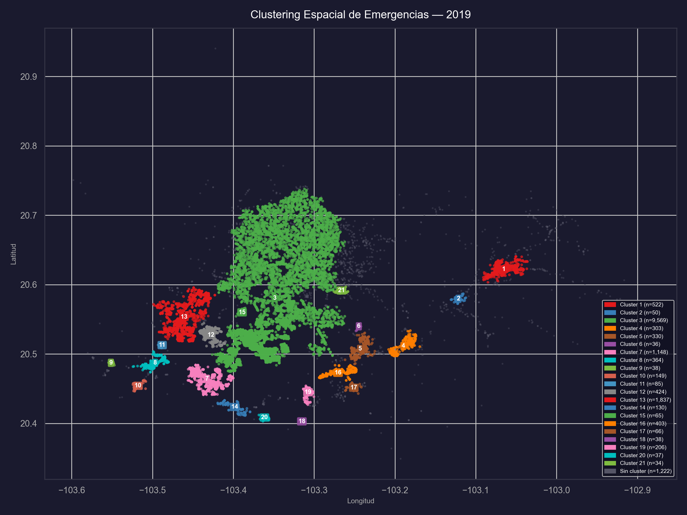
    
2019

  

  

    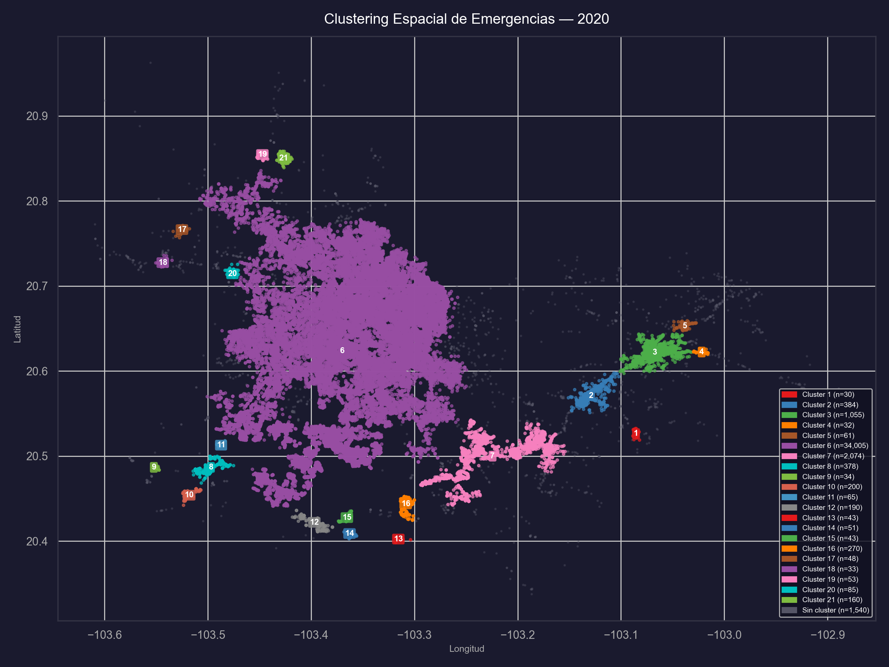
    
2020

  

  

    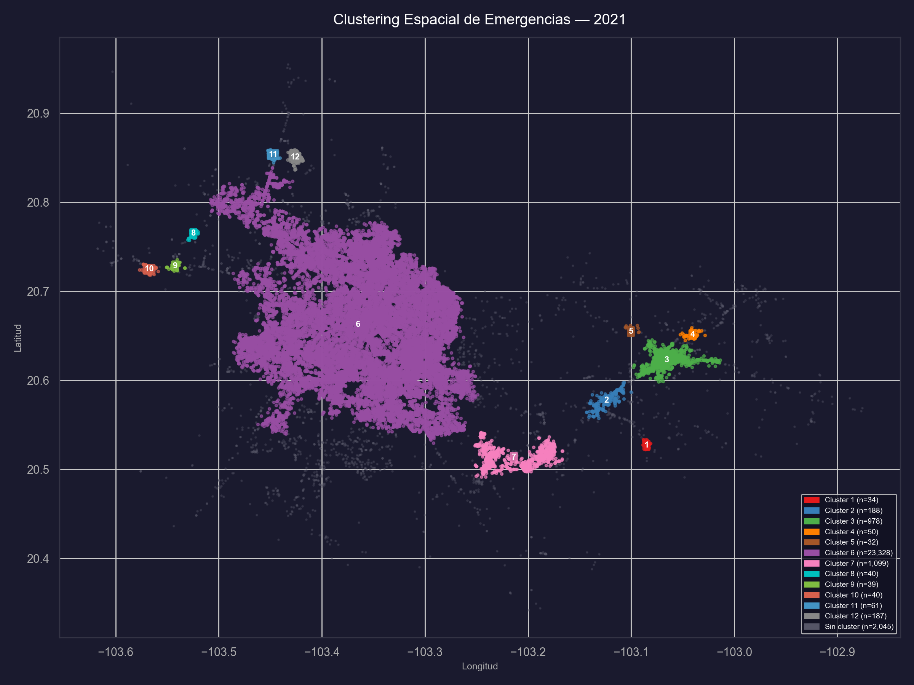
    
2021

  

---

# Evolución de Clusters: 2022–2023

  

    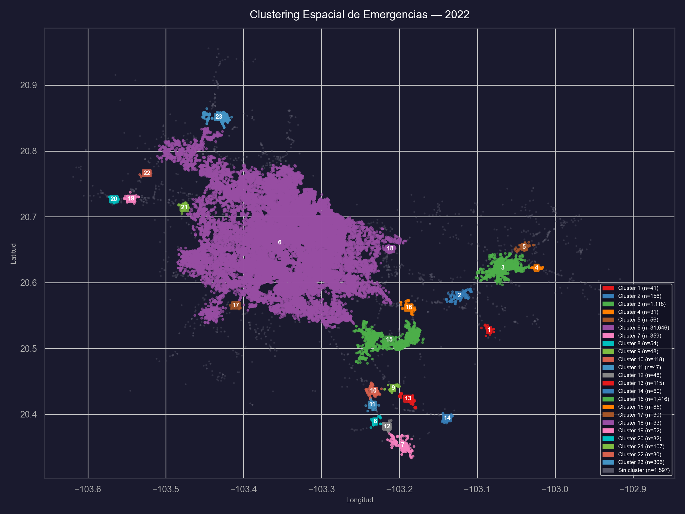
    
2022

  

  

    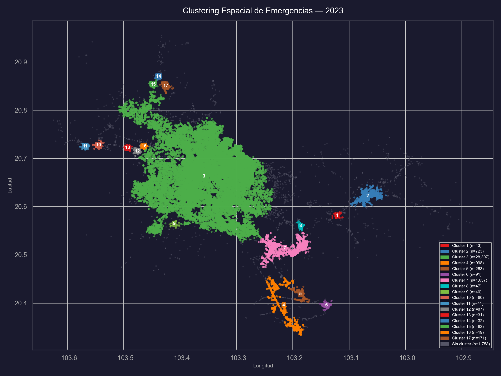
    
2023

  

---

# Priorización de Sitios Recurrentes (2022-2023)

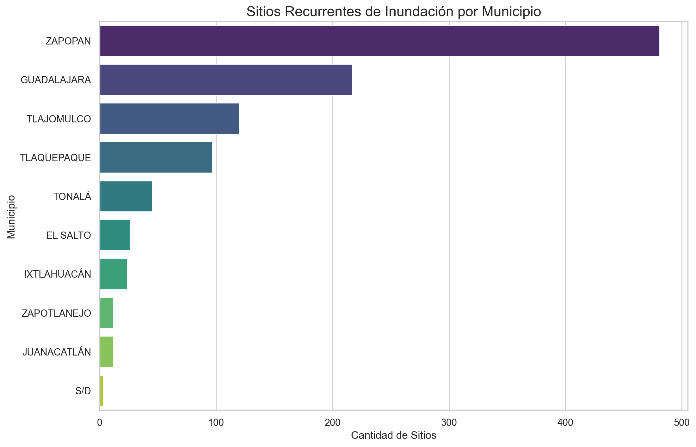

### Análisis de Priorización
- Se analizaron **1,037 registros** de sitios recurrentes documentados.
- **Zapopan** y **Guadalajara** concentran la mayor densidad de sitios que requieren intervención técnica.
- El análisis integra variables de recurrencia y nivel de riesgo reportado.

---

# Niveles de Priorización en el AMG

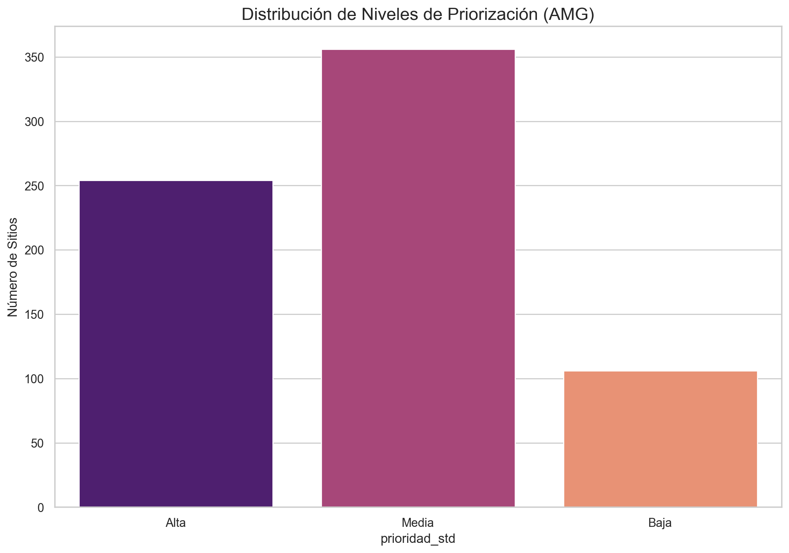

**Hallazgos Clave**
- Los niveles **Media** y **Alta** predominan en las zonas de expansión urbana.
- Existe una alta correlación entre los clusters de emergencias históricas y los sitios priorizados.

  <a href="analisis_priorizacion/mapa_priorizacion_interactivo.html">Ver Mapa Interactivo de Priorización</a>

---

# Conclusiones

- **Tendencia creciente**: El volumen de emergencias ha aumentado consistentemente entre 2020 y 2022.
- **Concentración urbana**: Guadalajara y Zapopan acumulan más del 50% de los reportes.
- **Incendios estacionales**: La recurrencia en el periodo de estiaje permite anticipar la asignación de recursos.
- **Fauna urbana**: Los enjambres representan un reto operativo de alta frecuencia.
- **Zonas críticas (Clusters)**: El análisis DBSCAN identifica núcleos persistentes de alta densidad, fundamentando la priorización espacial en los programas de mitigación.
- **Estandarización**: Permite análisis comparativos robustos para la planeación académica y gubernamental.

<!--
---

# Próximos Pasos

### Datos
- Búsqueda e integración de datos 2024.
- Incorporar datos socioeconómicos de INEGI.
- Validación de duplicados.

### Análisis
- Modelado predictivo de impacto.
- Análisis de tiempos de respuesta por zona.
- Integración de indicadores de vulnerabilidad social (INEGI).

-->
---

# Referencias

- **IMEPLAN** – Zoom metropolitano.
- **Protección Civil Jalisco** – Registros históricos de atención (2019–2023).
- **INEGI** – Marco Geoestadístico Municipal, AMG.
- **CONAVI** – Indicadores de vivienda.
<!--
- **Folium / Leaflet.js** – Visualización de mapas interactivos.
- **Seaborn / Matplotlib** – Visualización estadística en Python.
- **Marp** – Framework de presentaciones Markdown.
-->
---

# Gracias

### Integración de políticas de mitigación de riesgo
Análisis de Emergencias AMG 2019–2023